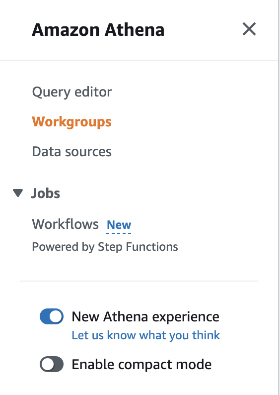
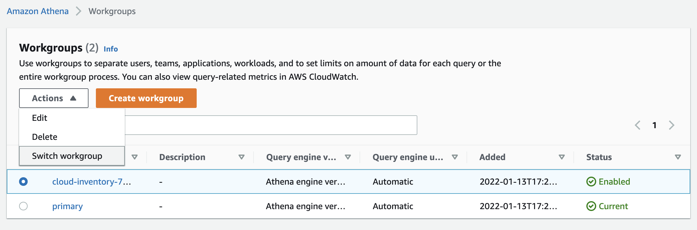
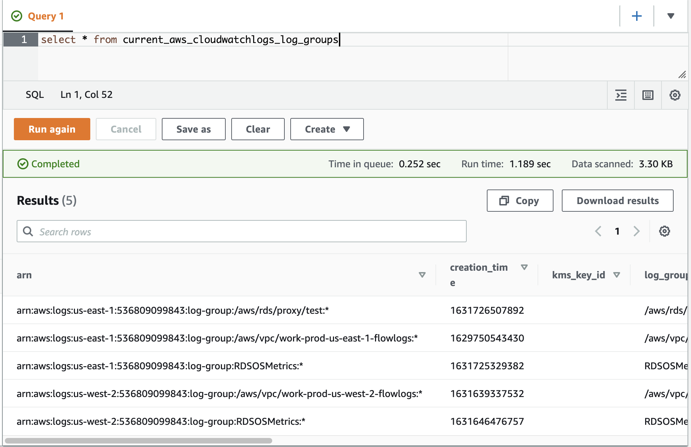

# Running cloud-inventory in a development environment

These instructions are meant to showcase an example of how cloud-inventory can be deployed, such that you can run queries in Athena. These instructions do not cover deploying the inventory gathering code to a server to run on a periodic basis, as one would do in production.

## Prerequisites

1. An AWS account, with API credentials on your local machine
2. Go 1.17+
3. Terraform

## Setting up your local environment

1. Clone the git repo to your local machine

```
git clone https://github.com/sheacloud/cloud-inventory.git
```

2. Change your working directory to cloud-inventory

```
cd ./cloud-inventory
```

3. Install the go package dependencies

```
go get ./...
```

## Deploying the necessary AWS infrastructure

cloud-inventory requires an S3 bucket to store the inventory data, along with Glue table schemas to allow for Athena querying. These resources can be deployed with Terraform samples provided in this repo.

1. Enter the example terraform directory
```
cd ./example/terraform/
```
2. Initialize the terraform state
```
terraform init
```
3. Deploy the terraform resources
```
terraform apply
'yes'
```
4. Export environment variables for use in later steps. Replace the values with those output by terraform, and set AWS_REGIONS to whatever regions you use
```
export CLOUD_INVENTORY_S3_BUCKET="REPLACE_ME_WITH_S3_BUCKET_NAME"
export CLOUD_INVENTORY_AWS_REGIONS="us-east-1,us-west-2"
export CLOUD_INVENTORY_AWS_USE_LOCAL_CREDENTIALS="true"
export CLOUD_INVENTORY_GLUE_DATABASE_NAME="REPLACE_ME_WITH_S3_BUCKET_NAME"
export CLOUD_INVENTORY_ATHENA_WORKGROUP_NAME="REPLACE_ME_WITH_S3_BUCKET_NAME"
```
5. Change back to the root cloud-inventory directory
```
cd ../../
```
6. Deploy the Athena views
```
go run ./cmd/autogen-views
```

## Run an inventory fetch to populate data into S3/Athena

1. Execute fetch-inventory
```
go run ./cmd/fetch-inventory
```

## Query the data in Athena

1. Log into the AWS console
2. Navigate to the Athena service page
3. Change your Athena workgroup to the one created by Terraform (name should be cloud-inventory-xxxxxxxxxx)
    - Select the "Workgroups" tab on the left of the page
    - Select the cloud-inventory-xxxxxxxx workgroup, click Actions, and then "Switch Workgroup"





4. Navigate to the Athena Query Editor (select the "Query editor" tab from the left of the page)
5. Run an example query to view data. Use the "current_*" views to view only the latest data ingested
```sql
select * from current_aws_cloudwatchlogs_log_groups
```



## Next Steps

That's it! You can re-run the fetch-inventory program at any point to ingest new data. The current_* athena views will always show only the most recent ingestions data, while the other views will show different aggregations of it.

## Additional Configuration

To run fetch-inventory across multiple AWS accounts, you need an IAM role in each account with the necessary permissions. fetch-inventory can be configured to assume into this role in any number of accounts to ingest data, so long as the local credentials allow assuming into the given IAM role.

To configure this:
1. Change the environment variable "CLOUD_INVENTORY_AWS_USE_LOCAL_CREDENTIALS" to "false" (this tells fetch-inventory to use cross-account IAM roles for ingesting data)
2. Export a new variable, "CLOUD_INVENTORY_AWS_ACCOUNT_IDS", with a comma-delimited list of AWS account IDs to fetch data from, e.g. "000011112222,333344445555,666677778888"
3. Export a new variable, "CLOUD_INVENTORY_AWS_ASSUME_ROLE_NAME", with the name of the IAM role to assume, e.g. "my-cross-account-iam-role"

Now when you run fetch-inventory, the code will assume into the IAM role in each account to ingest data, and store it all in the same central S3 bucket.

## Cleaning up the development environment

The entire development environment can be deleted by running a terraform destroy
```
cd ./example/terraform/
terraform destroy
```