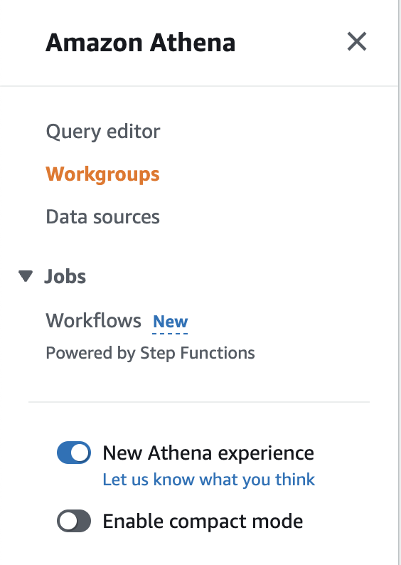

# Querying the data in Athena

This guide assumes you have already followed the steps outlined in [QUICKSTART_INGESTION.md](QUICKSTART_INGESTION.md)

1. Log into the AWS console
2. Navigate to the Athena service page
3. Change your Athena workgroup to the one created by Terraform (name should be cloud-inventory-xxxxxxxxxx)
    - Select the "Workgroups" tab on the left of the page
    - Select the cloud-inventory-xxxxxxxx workgroup, click Actions, and then "Switch Workgroup"




4. Navigate to the Athena Query Editor (select the "Query editor" tab from the left of the page)
5. Run an example query to view data. Use the "current_*" views to view only the latest data ingested
```sql
select * from current_aws_cloudwatchlogs_log_groups
```

